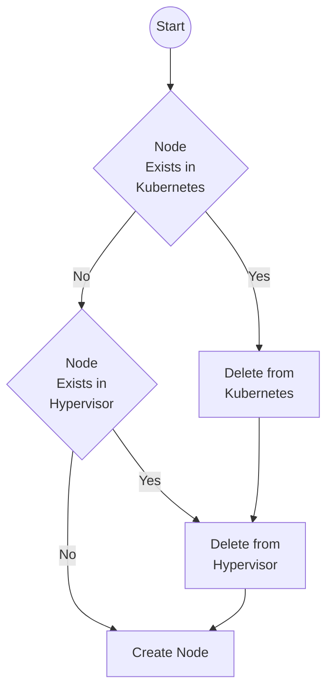

# Node Rotator Thoughts
The Node Rotator is a pretty destructive little tool, so I decided to put my thoughts about it into an document.

## Considerations
The node rotator needs to be able to know the exact state of every node.
If any node isn't in a running, healthy state, it needs to change its course, and instead of rotating a node, bring that unhealthy node up.
It needs to ask Kubernetes what's happening with the node, and if Kubernetes doesn't know about it, check what's going on at the hypervisor level.
If the hypervisor doesn't know what's up, chances are the node was fully taken down, and can be brought up fresh.
If the node _does_ exist only at the Hypervisor level, it's probably best to start the rotation assuming that it's been properly removed from Kubernetes, and can be nuked from there, even if it failed during the addition process.

The whole flow will probably look like this, with a few different controls at each level.

